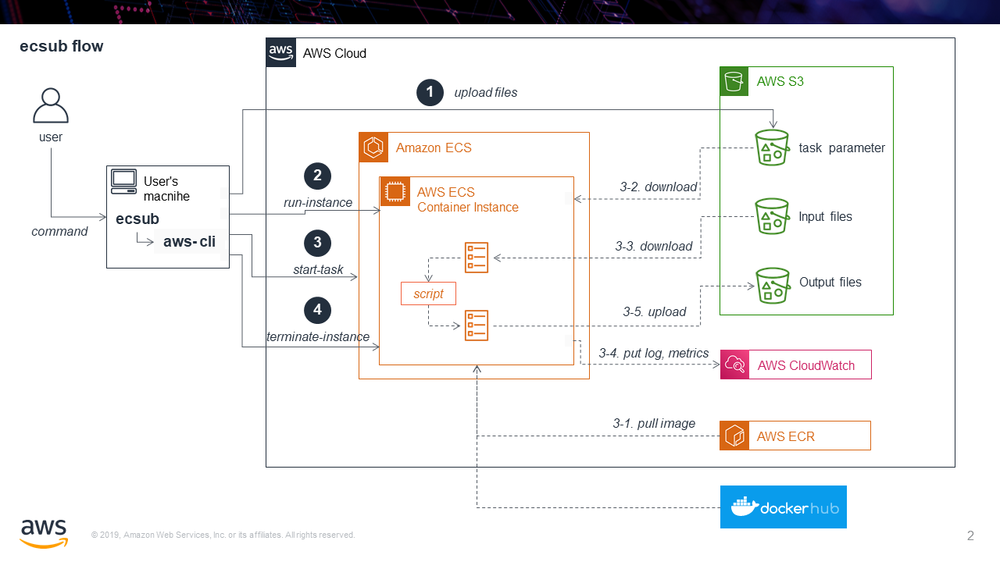
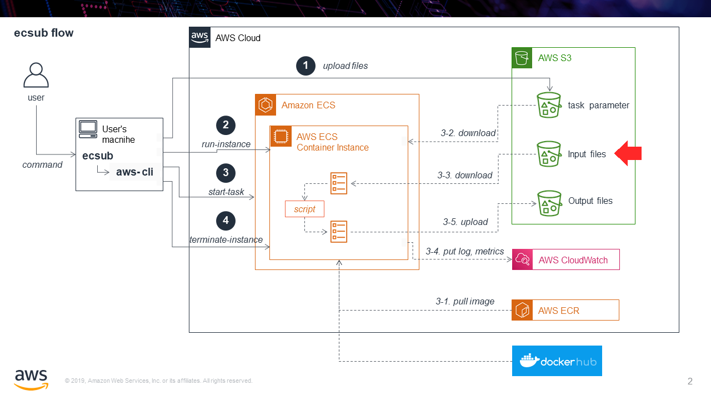
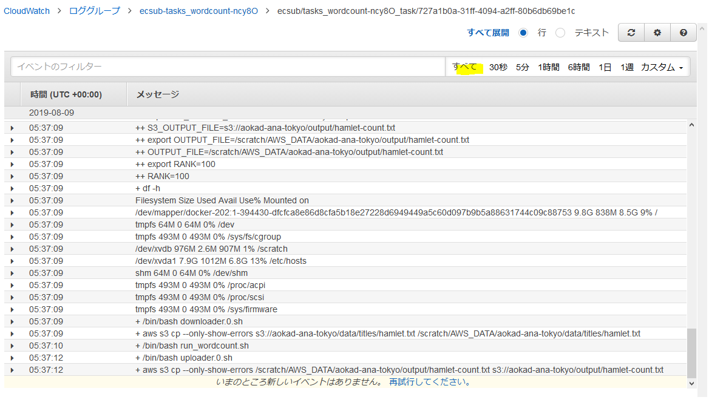

# ecsub チュートリアル

実際のジョブを実行するまでを解説します。  
事前に [インストール](./setup#install) を実行し動作確認を済ませておいてください。

## 概要

ecsub は Amazon Elastic Container Serve (Amazon ECS) を利用したバッチジョブ実行エンジンです。  
バッチジョブ実行の流れを以下の図に沿って解説します。  

 1. ecsub は指定されたファイルやオプションからタスク実行パラメータファイルを作成し、AWS S3 バケットにアップロードします。
 2. Amazon ECS にクラスタを作成し、コンテナインスタンス (EC2 インスタンス) を起動します。
 3. タスクを実行します。
    * 3-1. 指定されたコンテナイメージを pull します。
    * 3-2. タスク実行パラメータをダウンロードします。
    * 3-3. 入力ファイルをダウンロードします。
    * 3-4. タスクを実行します。実行ログおよびメトリクスをAWS CloudWatch にアップロードします。
    * 3-5. タスク実行結果（出力ファイル）をアップロードします。
 4. 不要になったコンテナインスタンスを削除します。



ecsub はこの一連の処理を `ecsub submit` 一つのコマンドで実行します。

**どこにインストールすればいいか？**

上の図ではユーザのローカルPC (Windows, Mac, Ubuntu, ...) にインストールしたものとして記載していますが、クラウド上の Linux 系サーバや AWS Cloud9 でも使用することができます。  
少し難易度は上がりますが、AWS Lambda でも使用することができます。

## ecsub コマンドの解説

ecsub には以下のサブコマンドがあります。

 - **submit**: ジョブを投入します。ジョブの終了を待ちます。
 - **away**: submit と同じくジョブを投入しますが、ジョブの終了を待ちません。（上級者向け）
 - **report**: ジョブの結果を表示します。
 - **delete**: ジョブを削除します。
 - **logs**: ジョブの実行ログをダウンロードします。

ここではタスクの投入を行う `aws submit` について解説します。

## ecsub submit コマンドの解説

### 必須オプション

|オプション名               |設定例              | 説明                                                        |
|:--------------------------|:-------------------|:------------------------------------------------------------|
|script                     | path/to/script.sh  | 実行スクリプトのパス (ローカルパスでも S3 アドレスでもよい) |
|tasks                      | path/to/tasks.tsv  | タスクファイル（[フォーマット](#format)）のパス             |
|aws-s3-bucket              | s3://output/bucket | s3 バケットのパス (ecsub 作業用ファイルが出力されます)      |
|aws-ec2-instance-type      | t2.micro           | 起動したいインスタンスタイプ (*1)                           |
|aws-ec2-instance-type-list | t3.micro,t2.micro  | 起動したいインスタンスタイプ (スポットインスタンス用) (*1)  |

(*1) どちらか一つを必ず指定してください

### 任意のオプション

|オプション名    | デフォルト                           | 説明                                                                    |
|:---------------|:-------------------------------------|:------------------------------------------------------------------------|
|wdir            | ./                                   | ローカルの ecsub 作業用ディレクトリ                                     |
|image           | python:2.7.14                        | コンテナインスタンスのイメージ                                          |
|use_amazon_ecr  | False                                | Amazon ECR を使用するか                                                 |
|task-name       | タスクファイル名 + "-" + 任意の5文字 | 作業用ディレクトリやコンソール出力、インスタンス名などに使用する        |
|processes       | 20                                   | 同時実行するジョブの最大数                                              |
|spot            | False                                | スポットインスタンスで起動するか                                        |
|retry-od        | False                                | スポットインスタンスで失敗した場合、オンデマンドインスタンスでやり直すか|
|ignore-location | False                                | ロケーションの違いを無視するか (*2)                                     |

(*2) ロケーション（リージョン）をまたいでデータのやり取りを行うと別途料金が発生しますので、チェック機能があります。

起動するAWS EC2 インスタンスに関する設定

|オプション名          | デフォルト                                    | 説明                              |
|:---------------------|:----------------------------------------------|:----------------------------------|
|disk-size             | 22                                            | アタッチするディスクサイズ (GiB)  |
|aws-security-group-id | (投入するVPC のデフォルトセキュリティグループ)| セキュリティグループID            |
|aws-key-name          | (新規作成し終了時に破棄)                      | キーペア名                        |
|aws-subnet-id         | (未指定)                                      | サブネットID                      |

### 通常設定する必要のないコマンド

通常変更する必要はありませんが、特殊なコンテナイメージを使用している場合などに使用します。

|オプション名         | デフォルト           | 説明                                              |
|:--------------------|:---------------------|:--------------------------------------------------|
|dind                 | False                | Docker in Dockerとして実行するか                  |
|request-payer-bucket | (None)               | リクエスタ払いのバケットがあれば "," 区切りで記載 |
|shell                | /bin/bash            | コンテナイメージ上のシェルのパス                  |
|setup-container-cmd  | "pip install awscli" | コンテナイメージジョブ実行前に行う設定コマンド    |

## タスクファイルの解説

タスクファイルと実行スクリプトはセットで扱います。  
以下の図を見てください。

実行スクリプトで使用したい変数をタスクファイルで設定しています。
1 行が 1 つのジョブです。


タスクファイルに 3 行あれば、3 つのジョブが実行されます。


### 記述ルール

タスクファイルは以下のルールで記載します。

 - タブ区切り ("\t")
 - 先頭はヘッダ
 - コメントは `#` で始めて、ヘッダの前に記載
 - ファイル名称、拡張子は任意

コンテナにコピーするもの

 - `--input [NAME]`  s3 ファイルのパス, 指定ファイルのみコピー
 - `--input-recursive [NAME]` s3 ディレクトリのパス, 再帰的にコピー

コンテナから外に出すもの

 - `--output [NAME]` s3 ファイルのパス, 指定ファイルのみコピー
 - `--output-recursive [NAME]` s3 ディレクトリのパス, 再帰的にコピー

環境変数のセット

 - `--env [NAME]` 環境変数
 - `--secret-env [NAME]` 暗号化した環境変数 (後述)

### 環境変数が複数ある場合

環境変数が複数ある場合は、別名で設定することができます。


### スクリプトに直接記入してもいい？

可能ですが、再利用性が損なわれるため、我々はタスクファイルの使用を推奨しています。


## サンプルデータを使用してバッチジョブを実行する

サンプルデータを用意していますので、実際にジョブを実行してみます。

### 1. サンプルデータのダウンロード

まず、データセットをダウンロードします。

```Bash
git clone https://github.com/aokad/wordcount.git
```

### 2. AWS S3 に入力ファイルをアップロード

解析したいデータを S3 にアップロードします。



今回はダウンロードしたディレクトリのうち、 `data` ディレクトリをすべて s3 にアップロードしてください。

コピーの例

```Bash
aws s3 cp --recursive ./wordcount/data s3://YOUR-BUCKET/wordcount/data
```

### 3. タスクファイルの編集

./wordcount/tasks-wordcount-file.tsv をテキストエディタで開いてください。

```
--input INPUT_FILE      --output OUTPUT_FILE    --env RANK
s3://{bucket-name}/data/titles/hamlet.txt       s3://{bucket-name}/output/hamlet-count.txt      100
s3://{bucket-name}/data/titles/kinglear.txt     s3://{bucket-name}/output/kinglear-count.txt    100
s3://{bucket-name}/data/titles/othello.txt      s3://{bucket-name}/output/othello-count.txt     100
```

`{bucket-name}` の個所を実際のファイルのパスに書き換えてください。

記載したパスが正しいかどうかは以下のコマンドで確認できます。

```Bash
# 正しい場合、情報が表示される
$ aws s3 ls s3://YOUR-BUCKET/wordcount/data/titles/hamlet.txt
2019-08-07 18:23:05     162851 hamlet.txt

# 間違っている場合、何も表示されない
$ aws s3 ls s3://YOUR-BUCKET/data/titles/hamlet.txt
$
```

### 4. docker image を作成

今回は作成済みですので割愛します。  
参考までに、今回使用する docker image の Dockerfile は `wordcount/Dockerfile` です。

### 5. 実行する

以下コマンドで実行します。  
`tasks` は編集したタスクファイルを使用してください。
`aws-s3-bucket` は実在するバケットのパスを指定してください。

```diff
ecsub submit \
+ --tasks ./wordcount/tasks-wordcount-file.tsv \
+ --aws-s3-bucket  s3://aokad-ana-singapore/ecsub-test \
  --script ./wordcount/wordcount-file.sh \
  --image aokad/wordcount \
  --aws-ec2-instance-type t2.micro \
  --disk-size 1
```

### 6. 実行中のログを確認する

実行中に以下のようなメッセージが表示されます。  
これはタスクごとの実行ログです。


記載されているアドレスをwebブラウザで開くとログが表示されます。

「すべて」でログの最後に移動できます。



### 7. タスクのレポートを見る

以下のコマンドでジョブの実行結果を見ることができます。

```Bash
ecsub report
```

レポートが表示されます。

```
| exit_code|                   taskname|  no| spot|          job_startAt|            job_endAt| instance_type|  cpu| memory| disk_size|   price|    instance_createAt|      instance_stopAt|                                                 log_local|
|       127| tasks-wordcount-file-AHLXu| 000|    F| 2019/08/07 18:40:31 | 2019/08/07 18:54:20 |      t2.micro| 1024|    900|         1| 0.00469| 2019/08/07 18:40:31 | 2019/08/07 18:54:20 | ./tasks-wordcount-file-AHLXu/log/describe-tasks.000.2.log|
|       127| tasks-wordcount-file-AHLXu| 001|    F| 2019/08/07 18:40:36 | 2019/08/07 18:57:03 |      t2.micro| 1024|    900|         1| 0.00558| 2019/08/07 18:40:36 | 2019/08/07 18:57:03 | ./tasks-wordcount-file-AHLXu/log/describe-tasks.001.2.log|
|       127| tasks-wordcount-file-AHLXu| 002|    F| 2019/08/07 18:40:41 | 2019/08/07 18:57:23 |      t2.micro| 1024|    900|         1| 0.00567| 2019/08/07 18:40:41 | 2019/08/07 18:57:23 | ./tasks-wordcount-file-AHLXu/log/describe-tasks.002.2.log|
|         1| tasks-wordcount-file-PsY3e| 000|    F| 2019/08/07 19:01:26 | 2019/08/07 19:06:03 |      t2.micro| 1024|    900|         1| 0.00156| 2019/08/07 19:01:26 | 2019/08/07 19:06:03 | ./tasks-wordcount-file-PsY3e/log/describe-tasks.000.0.log|
|         1| tasks-wordcount-file-PsY3e| 001|    F| 2019/08/07 19:01:31 | 2019/08/07 19:06:31 |      t2.micro| 1024|    900|         1| 0.00170| 2019/08/07 19:01:31 | 2019/08/07 19:06:31 | ./tasks-wordcount-file-PsY3e/log/describe-tasks.001.0.log|
|         1| tasks-wordcount-file-PsY3e| 002|    F| 2019/08/07 19:01:36 | 2019/08/07 19:06:36 |      t2.micro| 1024|    900|         1| 0.00170| 2019/08/07 19:01:36 | 2019/08/07 19:06:36 | ./tasks-wordcount-file-PsY3e/log/describe-tasks.002.0.log|
```

各項目

 - **exit_code**: 終了コード。 "0" であれば成功です。
 - **taskname**: タスク名
 - **no**: ジョブ番号 (タスクファイルの行番号に等しい)
 - **spot**: スポットインスタンスかどうか
 - **job_startAt**: ジョブの開始時刻
 - **job_endAt**: ジョブの終了時刻
 - **instance_type**: インスタンスタイプ
 - **cpu**: 起動したインスタンスのcpu
 - **memory**: 起動したインスタンスのメモリ
 - **disk_size**: アタッチしたディスクサイズ (GiB)
 - **price**: 価格 (USD) (*1)
 - **instance_createAt**: インスタンスの起動時刻
 - **instance_stopAt**: インスタンスの終了時刻
 - **log_local**: ジョブファイルのパス (*2)

(*1) 価格は以下で計算しています。通信やその他サービス使用料は計算に含めていませんので、実際とは異なることがあります。

```
インスタンスの単価＊起動時間＋ディスクの単価＊サイズ＊アタッチしたインスタンスの起動時間
```

(*2) ジョブのログは以下も参考にしてください。


