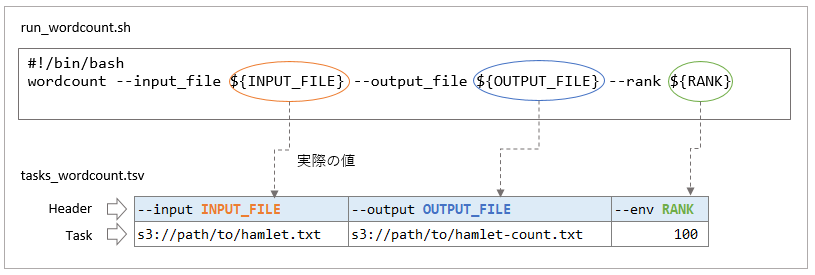
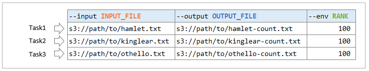
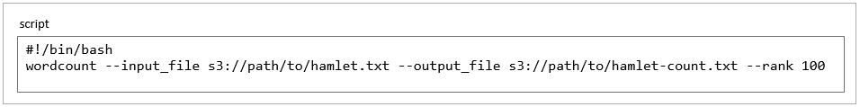
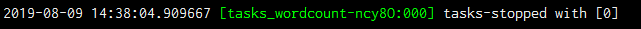
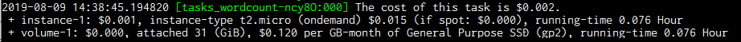

# ecsub チュートリアル

実際のジョブを実行するまでを解説します。  
事前に [インストール](./setup#install-and-setup) を実行し動作確認を済ませておいてください。

## Overview

ecsub は Amazon Elastic Container Serve (Amazon ECS) を利用したバッチジョブ実行エンジンです。  
投入されたジョブはタスクファイルに記述された行数分のタスクを持ち、タスクの数だけコンテナインスタンスを起動します。  

 --> 参考：[Amazon ECS コンテナインスタンス](https://docs.aws.amazon.com/ja_jp/AmazonECS/latest/developerguide/ECS_instances.html)

バッチジョブ実行の流れを以下の図に沿って解説します。  

[](./assets/images/ecsub-flow.PNG)

 1. ecsub は指定されたファイルやオプションからタスク実行パラメータファイルを作成し、AWS S3 バケットにアップロードします。
 2. Amazon ECS にクラスタを作成し、コンテナインスタンスを起動します。
 3. 各タスクを実行します。
    * 3-1. 指定されたコンテナイメージを pull します。
    * 3-2. タスク実行パラメータをダウンロードします。
    * 3-3. 入力ファイルをダウンロードします。
    * 3-4. タスクを実行します。実行ログおよびメトリクスをAWS CloudWatch にアップロードします。
    * 3-5. タスク実行結果（出力ファイル）をアップロードします。
 4. 不要になったコンテナインスタンスを削除します。

ecsub はこの一連の処理を `ecsub submit` 一つのコマンドで実行します。

**どこにインストールすればいいか？**

上の図ではユーザのローカルPC (Windows, Mac, Ubuntu, ...) にインストールしたものとして記載していますが、クラウド上の Linux 系サーバや AWS Cloud9 でも使用することができます。  
少し難易度は上がりますが、AWS Lambda でも使用することができます。

## ecsub コマンドの解説

ecsub には以下のサブコマンドがあります。

 - **submit**: ジョブを投入します。ジョブの終了を待ちます。
 - **away**: submit と同じくジョブを投入しますが、ジョブの終了を待ちません。（上級者向け）
 - **report**: タスクの結果を表示します。
 - **delete**: ジョブを削除します。
 - **logs**: タスクの実行ログをダウンロードします。

ここではジョブの投入を行う `aws submit` について解説します。

```Bash
ecsub submit --help
```

### 必須オプション

|オプション名               |設定例              | 説明                                                        |
|:--------------------------|:-------------------|:------------------------------------------------------------|
|script                     | path/to/script.sh  | 実行スクリプトのパス (ローカルパスでも S3 アドレスでもよい) |
|tasks                      | path/to/tasks.tsv  | タスクファイル（[フォーマット](#format)）のパス             |
|aws-s3-bucket              | s3://output/bucket | s3 バケットのパス (ecsub 作業用ファイルが出力されます)      |
|aws-ec2-instance-type      | t2.micro           | 起動したいインスタンスタイプ (*1)                           |
|aws-ec2-instance-type-list | t3.micro,t2.micro  | 起動したいインスタンスタイプ (スポットインスタンス用) (*1)  |

(*1): どちらか一つを必ず指定してください

### 任意のオプション

|オプション名    | デフォルト                           | 説明                                                                    |
|:---------------|:-------------------------------------|:------------------------------------------------------------------------|
|wdir            | ./                                   | ローカルの ecsub 作業用ディレクトリ                                     |
|image           | python:2.7.14                        | コンテナインスタンスのイメージ                                          |
|use_amazon_ecr  | False                                | Amazon ECR を使用するか                                                 |
|task-name       | タスクファイル名 + "-" + 任意の5文字 | 作業用ディレクトリやコンソール出力、インスタンス名などに使用する        |
|processes       | 20                                   | 同時実行するタスクの最大数                                              |
|spot            | False                                | スポットインスタンスで起動するか                                        |
|retry-od        | False                                | スポットインスタンスで失敗した場合、オンデマンドインスタンスでやり直すか|
|ignore-location | False                                | ロケーションの違いを無視するか (*2)                                     |

(*2): ロケーション（リージョン）をまたいでデータのやり取りを行うと別途料金が発生しますので、チェック機能があります。

**起動するAWS EC2 インスタンスに関する設定**

|オプション名          | デフォルト                                    | 説明                              |
|:---------------------|:----------------------------------------------|:----------------------------------|
|disk-size             | 22                                            | アタッチするディスクサイズ (GiB)  |
|aws-security-group-id | (投入するVPC のデフォルトセキュリティグループ)| セキュリティグループID            |
|aws-key-name          | (新規作成し終了時に破棄)                      | キーペア名                        |
|aws-subnet-id         | (未指定)                                      | サブネットID                      |

### 通常設定する必要のないコマンド

通常変更する必要はありませんが、特殊なコンテナイメージを使用している場合などに使用します。

|オプション名         | デフォルト           | 説明                                              |
|:--------------------|:---------------------|:--------------------------------------------------|
|dind                 | False                | Docker in Dockerとして実行するか                  |
|request-payer-bucket | (None)               | リクエスタ払いのバケットがあれば "," 区切りで記載 |
|shell                | /bin/bash            | コンテナイメージ上のシェルのパス                  |
|setup-container-cmd  | "pip install awscli" | コンテナイメージ設定コマンド                      |

## タスクファイルの解説

タスクファイルと実行スクリプトはセットで扱います。  
以下の図を見てください。

実行スクリプトで使用したい変数をタスクファイルで設定しています。
1 行が 1 つのタスクです。

[](./assets/images/tasks1.PNG)

タスクファイルに 3 行あれば、3 つのタスクが実行されます。

[](./assets/images/tasks2.PNG)

### 記述ルール

タスクファイルは以下のルールで記載します。

 - タブ区切り ("\t")
 - 先頭はヘッダ
 - コメントは `#` で始めて、ヘッダの前に記載
 - ファイル名称、拡張子は任意

S3 バケットからコンテナインスタンスにダウンロードするもの

 - `--input [NAME]`  s3 ファイルのパス, 指定ファイルのみコピー
 - `--input-recursive [NAME]` s3 ディレクトリのパス, 再帰的にコピー

コンテナインスタンスからS3 バケットにアップロードするもの

 - `--output [NAME]` s3 ファイルのパス, 指定ファイルのみコピー
 - `--output-recursive [NAME]` s3 ディレクトリのパス, 再帰的にコピー

環境変数

 - `--env [NAME]` 環境変数
 - `--secret-env [NAME]` 暗号化した環境変数 ([後述](./features#タスクファイルの暗号化))

### 環境変数が複数ある場合

環境変数が複数ある場合は、別名で設定することができます。

[](./assets/images/tasks3.PNG)

### スクリプトに直接記入してもいい？

実際はコンテナインスタンスにダウンロードした後、実際のスクリプトにはコンテナインスタンス内部のパスを渡しています。  
そのため、スクリプトに直接 S3 のパスを入力してもインスタンスからはアクセスすることができずうまく動きません。

[](./assets/images/tasks4.PNG)

※ ツールによっては直接 S3 のパスを入力できるものもあります。  
   コピー不要であれば、`--input` ではなく `--env` に設定してください。

## バッチジョブを実行する

サンプルデータを用意していますので、実際にジョブを実行してみます。

### 1. サンプルデータのダウンロード

まず、データセットをダウンロードします。

```Bash
git clone https://github.com/aokad/wordcount.git
```

### 2. AWS S3 に入力ファイルをアップロード

解析したいデータを S3 にアップロードします。

[](./assets/images/input-bucket.PNG)

今回はダウンロードしたディレクトリのうち、 `data` ディレクトリをすべて s3 にアップロードしてください。

アップロードの例

```Bash
export YOUR_BUCKET=${任意のバケット名}
aws s3 cp --recursive ./wordcount/data s3://${YOUR_BUCKET}/data
```

### 3. タスクファイルの編集

`./wordcount/tasks_wordcount.tsv` をテキストエディタで開いてください。

```
--input INPUT_FILE      --output OUTPUT_FILE    --env RANK
s3://{bucket-name}/data/titles/hamlet.txt       s3://{bucket-name}/output/hamlet-count.txt      100
s3://{bucket-name}/data/titles/kinglear.txt     s3://{bucket-name}/output/kinglear-count.txt    100
s3://{bucket-name}/data/titles/othello.txt      s3://{bucket-name}/output/othello-count.txt     100
```

`{bucket-name}` の個所を実際のファイルのパスに書き換えてください。

記載したパスが正しいかどうかは以下のコマンドで確認できます。

```Bash
# 正しい場合、情報が表示される
$ aws s3 ls s3://${YOUR_BUCKET}/data/titles/hamlet.txt
2019-08-07 18:23:05     162851 hamlet.txt

# 間違っている場合、何も表示されない
$ aws s3 ls s3://${YOUR_BUCKET}/error-path/hamlet.txt
$
```

### 4. docker image を作成

今回は作成済みですので割愛します。  

--> 参考：今回使用する docker image

 - [dockerhub](https://cloud.docker.com/u/aokad/repository/docker/aokad/wordcount)
 - [Dockerfile](https://raw.githubusercontent.com/aokad/wordcount/master/Dockerfile)

### 5. 実行する

以下コマンドで実行します。  
`tasks` は編集したタスクファイルを使用してください。  

```diff
ecsub submit \
+ --tasks ./wordcount/tasks_wordcount.tsv \
  --aws-s3-bucket  s3://${YOUR_BUCKET}/ecsub-test \
  --script ./wordcount/run_wordcount.sh \
  --image aokad/wordcount \
  --aws-ec2-instance-type t2.micro \
  --disk-size 1
```

タスクが成功すると `exit_code 0` で終了します。  
実行中に以下のようなメッセージが表示されると、そのタスクは成功です。  

[](./assets/images/success.PNG)

失敗したときはエラーが表示されます。  

[](./assets/images/fail.PNG)

全てのタスクが成功すれば "ecsub completed successfully!" と表示されます。

[](./assets/images/success2.PNG)

うまくいかない場合は…  
--> [エラーかな？と思ったら](./trouble-shooting)

### 6. 実行中のログを確認する

実行中に以下のようなメッセージが表示されます。  
これはタスクごとの実行ログです。

[](./assets/images/log-link.PNG)

記載されているアドレスをwebブラウザで開くとログが表示されます。  
「すべて」でログの最後に移動できます。

[](./assets/images/cloudwatch-log-1.PNG)

--> 参考：[タスク実行ログ](./features#タスク実行ログ)

### 7. タスクのコスト

タスク実行中に以下のログが表示されます。

[](./assets/images/cost.PNG)

これはタスクのコストを示しています。  

注意1：小数点 3 桁までの表示ですので、実際の料金とは差異があります。  
注意2：通信やその他サービス使用料は計算に含めていませんので、実際とは異なることがあります。

1行目：  
  `The cost of this task is $0.002.`

今回のタスクは $0.002 であったことを示しています。  
`+` で始まる行は内訳です。

2行目：  
  `+ instance-1: $0.002, instance-type t2.micro (ondemand) $0.015 (if spot: $0.000), running-time 0.109 Hour`

2行目はインスタンス料金です。 $0.002 がインスタンス料金で、そのあと単価が続きます。 
() の中はもし、スポットインスタンスであれば、という比較用の料金です。  
今回は $0.000 と表示されていますが、小数点 3 桁までの表示ですので、無料というわけではありません。

3行目：  
  `+ volume-1: $0.001, attached 31 (GiB), $0.120 per GB-month of General Purpose SSD (gp2), running-time 0.109 Hour`

3行目はアタッチしたボリュームの料金です。 $0.001 が料金で、そのあと単価が続きます。 
ディスクサイズには `disk` オプションで指定した 1GiB とは別にバックエンドのディスク 30 GiB を含んでいます。

### 8. タスクのレポートを見る

以下のコマンドでタスクごとの実行結果を見ることができます。

```Bash
ecsub report
```

レポートが表示されます。

```
| exit_code|                    taskname|  no| spot|         task_startAt|           task_endAt| instance_type|  cpu| memory| disk_size|   price|    instance_createAt|      instance_stopAt|                                                  log_local|
|         0|       tasks_wordcount-ncy8O| 000|    F| 2019/08/09 14:34:03 | 2019/08/09 14:38:38 |      t2.micro| 1024|    900|        31| 0.00155| 2019/08/09 14:34:03 | 2019/08/09 14:38:38 |       ./tasks_wordcount-ncy8O/log/describe-tasks.000.0.log|
|         0|       tasks_wordcount-ncy8O| 001|    F| 2019/08/09 14:34:08 | 2019/08/09 14:38:43 |      t2.micro| 1024|    900|        31| 0.00156| 2019/08/09 14:34:08 | 2019/08/09 14:38:43 |       ./tasks_wordcount-ncy8O/log/describe-tasks.001.0.log|
|         0|       tasks_wordcount-ncy8O| 002|    F| 2019/08/09 14:34:13 | 2019/08/09 14:38:04 |      t2.micro| 1024|    900|        31| 0.00130| 2019/08/09 14:34:13 | 2019/08/09 14:38:04 |       ./tasks_wordcount-ncy8O/log/describe-tasks.002.0.log|
|         2| tasks_wordcount_error-1LT6A| 000|    F| 2019/08/09 15:06:25 | 2019/08/09 15:11:32 |      t2.micro| 1024|    900|        31| 0.00173| 2019/08/09 15:06:25 | 2019/08/09 15:11:32 | ./tasks_wordcount_error-1LT6A/log/describe-tasks.000.0.log|
```

成功したタスクは `exit_code` が `0` になっています。

各項目について、詳細はこちらを参照ください。

--> [レポート](./logs#レポート)

### 9. ディレクトリを入力にしたサンプル

最後にファイル入力 (--input) ではなく、ディレクトリ入力 (--input-recursive) のサンプルを実行してチュートリアルは終了とします。

スクリプトとタスクファイルはダウンロードした `wordcount` ディレクトリにあります。

```
wordcount/
├── data
│   └── hamlet <------------------- 今回の入力データのディレクトリ
│      ├── hamlet_act1_scene1.txt
│      ├── hamlet_act1_scene2.txt
│      │     ...
│      └── hamlet_act5_scene2.txt
│
├── example
│   └── tasks_wordcount_dir.tsv <-- ディレクトリ入力のタスクファイル
│   └── run_wordcount_dir.sh <----- ディレクトリ入力のスクリプト
├── python/
│
├── Dockerfile
├── tasks_wordcount.tsv
├── README.md
└── run_wordcount.sh
```

手順：

1. S3 のパスに合わせてタスクファイルを編集します。
1. 編集したタスクファイルを使用して `ecsub submit` を実行します。

```diff
ecsub submit \
+ --tasks ??? \
+ --script ??? \
  --aws-s3-bucket  s3://${YOUR-BUCKET}/ecsub-test \
  --image aokad/wordcount \
  --aws-ec2-instance-type t2.micro \
  --disk-size 1
```

--> [ログファイルの解説](./logs)  
--> [そのほかの機能](./features)

