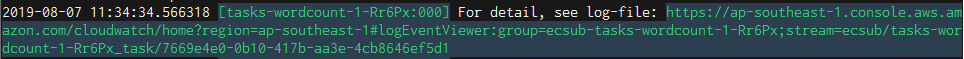

# ecsub のディレクトリ

ecsub は `--wdir` で指定されるディレクトリに中間ファイルやログを出力します。

```
tasks-wordcount-file-QQppj/
├── conf
│   ├── block_device_mappings.000.json
│   ├── block_device_mappings.001.json
│   ├── block_device_mappings.002.json
│   ├── containerOverrides.000.json
│   ├── containerOverrides.001.json
│   ├── containerOverrides.002.json
│   ├── task_definition.json
│   ├── userdata.000.sh
│   ├── userdata.001.sh
│   └── userdata.002.sh
├── log
│   ├── create-cluster.0.log
│   ├── create-key-pair.0.log
│   ├── create-tags.000.0.log
│   ├── create-tags.001.0.log
│   ├── create-tags.002.0.log
│   ├── delete-cluster.0.log
│   ├── delete-key-pair.0.log
│   ├── deregister-task-definition.0.log
│   ├── describe-container-instances.000.0.log
│   ├── describe-container-instances.001.0.log
│   ├── describe-container-instances.002.0.log
│   ├── describe-tasks.000.0.log
│   ├── describe-tasks.001.0.log
│   ├── describe-tasks.002.0.log
│   ├── register-task-definition.0.log
│   ├── run-instances.000.0.log
│   ├── run-instances.001.0.log
│   ├── run-instances.002.0.log
│   ├── start-task.000.0.log
│   ├── start-task.001.0.log
│   ├── start-task.002.0.log
│   ├── summary.000.log
│   ├── summary.001.log
│   ├── summary.002.log
│   ├── terminate-instances.0.log
│   ├── terminate-instances.000.0.log
│   ├── terminate-instances.001.0.log
│   └── terminate-instances.002.0.log
├── metrics
│   ├── 0-CPUUtilization.txt
│   ├── 0-DataStorageUtilization.txt
│   ├── 0-MemoryUtilization.txt
│   ├── 1-CPUUtilization.txt
│   ├── 1-DataStorageUtilization.txt
│   ├── 1-MemoryUtilization.txt
│   ├── 2-CPUUtilization.txt
│   ├── 2-DataStorageUtilization.txt
│   └── 2-MemoryUtilization.txt
└── script
    ├── downloader.0.sh
    ├── downloader.1.sh
    ├── downloader.2.sh
    ├── run.sh
    ├── setenv.0.sh
    ├── setenv.1.sh
    ├── setenv.2.sh
    ├── uploader.0.sh
    ├── uploader.1.sh
    └── uploader.2.sh
```

|ディレクトリ名|説明|
|:-------------|:---|
|conf          | EC2 インスタンスの起動など、AWS への環境構築のために作成したファイルです。|
|log           | 各種コマンドのログです。([後述](#log-ディレクトリ))|
|metrics       | タスクごとのメトリクスです。([後述](#メトリクス))|
|script        | タスクごとのインスタンスに渡すスクリプトです。S3 にもコピーされています。|

## log ディレクトリ

 - $R: リトライ数 (今のところ、0固定)
 - $N: タスク No. (0補填3桁、タスクファイルの記入順に等しい)

| ファイル名                             | 説明                                                    |
|:---------------------------------------|:--------------------------------------------------------|
| create-cluster.$R.log                  | Amazon ECS Cluster 作成                                 |
| create-key-pair.$R.log                 | AWS EC2 key-pair 作成                                   |
| create-tags.$N.$R.log                  | AWS EC2 インスタンスにタグ設定                          |
| delete-cluster.$R.log                  | Amazon ECS Cluster 削除                                 |
| delete-key-pair.$R.log                 | AWS EC2 key-pair 作成                                   |
| deregister-task-definition.$R.log      | Amazon ECS task 定義削除                                |
| describe-container-instances.$N.$R.log | Amazon ECS コンテナインスタンス情報取得                 |
| describe-tasks.$N.$R.log               | ★ Amazon ECS タスク情報取得                            |
| register-task-definition.$R.log        | Amazon ECS task 定義作成                                |
| run-instances.$N.$R.log                | AWS EC2 インスタンス作成                                |
| start-task.$N.$R.log                   | Amazon ECS タスク投入                                   |
| summary.$N.log                         | ★ サマリ                                               |
| terminate-instances.$R.log             | AWS EC2 インスタンス削除<br>（全体終了時に念のため実行）|
| terminate-instances.$N.$R.log          | AWS EC2 インスタンス削除                                |

★ 実行時間、コスト、終了コードなど[レポート](#レポート)で出力している情報の元になっているファイルです。

## メトリクス

メトリクスはコンテナインスタンス起動中、1 分に 1 回 AWS CloudWatch メトリクスに収集されています。  
しかし、一定時間経過後削除されてしまいますので、タスク終了時にダウンロードしています。

メトリクスはタスクごとに３種類の情報を取得しています。

 - $N: タスク No. (タスクファイルの記入順に等しい)

| ファイル名                    | 説明                        |
|:------------------------------|:----------------------------|
| $N-CPUUtilization.txt         | CPU 使用率 (%)              |
| $N-DataStorageUtilization.txt | データストレージ 使用率 (%) |
| $N-MemoryUtilization.txt      | メモリ 使用率 (%)           |


```
$ head tasks-wordcount/metrics/0-DataStorageUtilization.txt
Index   Timestamp               Maximum Unit
0       2019/08/08 04:49:00     1       Percent
1       2019/08/08 04:50:00     1       Percent
2       2019/08/08 04:51:00     1       Percent
```

### AWS コンソールから直接参照する場合

以下の手順でアクセスします。

1. AWS コンソールにログインし、cloudwatch サービスに移動
1. メトリクス → ECSUB → ClusterName, InstanceId の順に移動
1. 表示したいメトリクスを選択


## 実行ログ

タスク実行中のログは AWS CloudWatch ログに収集されています。  

タスク実行中にアドレスが表示されていますので、web ブラウザにコピペしてアクセスできます。



ターミナルを閉じた後に参照したい場合は以下の手順でアクセスできます。

1. AWS コンソールにログインし、cloudwatch ログに移動
1. フィルタに「ecsub-${タスク名}」を入力


タスク名は ecsub 作業ディレクトリのディレクトリ名であり、デフォルトではタスクファイル名 + 任意の5文字です。


`ecsub logs` コマンドでローカルにダウンロードすることもできます。

オプション

 - **wdir** ecsub の作業ディレクトリです。デフォルトでは "./" です。
 - **prefix** タスク名
 - **rm** 指定するとAWSから削除します 
 - **dw** 指定するとダウンロードします


特定のタスクをダウンロードする

```Bash
ecsub logs --wdir /tmp/ecsub --prefix tasks-wordcount-file-QQppj --dw
```

特定のタスクを削除する

```Bash
ecsub logs --wdir /tmp/ecsub --prefix tasks-wordcount-file-QQppj --rm
```

特定のタスクをダウンロードし、AWS からは削除する

```Bash
ecsub logs --wdir /tmp/ecsub --prefix tasks-wordcount-file-QQppj --dw
```

task-wordcount から始まるタスクすべてダウンロード

```Bash
ecsub logs --wdir /tmp/ecsub --prefix tasks-wordcount --dw
```

## レポート

以下のコマンドでジョブの実行結果を見ることができます。

```Bash
ecsub report
```

レポートが表示されます。

```
| exit_code|                   taskname|  no| spot|          job_startAt|            job_endAt| instance_type|  cpu| memory| disk_size|   price|    instance_createAt|      instance_stopAt|                                                 log_local|
|         0| tasks-wordcount-file-QQppj| 000|    F| 2019/08/08 13:06:46 | 2019/08/08 13:11:49 |      t2.micro| 1024|    900|         1| 0.00171| 2019/08/08 13:06:46 | 2019/08/08 13:11:49 | ./tasks-wordcount-file-QQppj/log/describe-tasks.000.0.log|
|         0| tasks-wordcount-file-QQppj| 001|    F| 2019/08/08 13:06:51 | 2019/08/08 13:11:44 |      t2.micro| 1024|    900|         1| 0.00166| 2019/08/08 13:06:51 | 2019/08/08 13:11:44 | ./tasks-wordcount-file-QQppj/log/describe-tasks.001.0.log|
|         0| tasks-wordcount-file-QQppj| 002|    F| 2019/08/08 13:06:56 | 2019/08/08 13:11:57 |      t2.micro| 1024|    900|         1| 0.00170| 2019/08/08 13:06:56 | 2019/08/08 13:11:57 | ./tasks-wordcount-file-QQppj/log/describe-tasks.002.0.log|
```

各項目

 - **exit_code**: 終了コード。 "0" であれば成功です。
 - **taskname**: タスク名
 - **no**: ジョブ番号 (タスクファイルの行番号に等しい)
 - **spot**: スポットインスタンスかどうか
 - **job_startAt**: ジョブの開始時刻
 - **job_endAt**: ジョブの終了時刻
 - **instance_type**: インスタンスタイプ
 - **cpu**: 起動したインスタンスのcpu
 - **memory**: 起動したインスタンスのメモリ
 - **disk_size**: アタッチしたディスクサイズ (GiB) (*1)
 - **price**: 価格 (USD) (*2)
 - **instance_createAt**: インスタンスの起動時刻
 - **instance_stopAt**: インスタンスの終了時刻
 - **log_local**: ジョブファイルのパス

(*1) ディスクサイズにはバックエンドのディスクサイズ 30 GiB を別途含んでいます。

(*2) 価格は以下で計算しています。通信やその他サービス使用料は計算に含めていませんので、実際とは異なることがあります。

```
インスタンスの単価＊起動時間＋ディスクの単価＊サイズ＊アタッチしたインスタンスの起動時間
```
