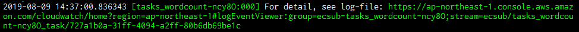

# ecsub の実行結果

ecsub は `--wdir` で指定されるディレクトリに中間ファイルやログを出力します。

```
tasks-wordcount-QQppj/ (タスク名)
├── conf
│   ├── block_device_mappings.000.json
│   ├── block_device_mappings.001.json
│   │     ...
│   ├── userdata.001.sh
│   └── userdata.002.sh
├── log
│   ├── create-cluster.0.log
│   ├── create-key-pair.0.log
│   │     ...
│   ├── terminate-instances.001.0.log
│   └── terminate-instances.002.0.log
├── metrics
│   ├── 0-CPUUtilization.txt
│   ├── 0-DataStorageUtilization.txt
│   │     ...
│   ├── 2-DataStorageUtilization.txt
│   └── 2-MemoryUtilization.txt
└── script
    ├── downloader.0.sh
    ├── downloader.1.sh
    │     ...
    ├── uploader.1.sh
    └── uploader.2.sh
```

|ディレクトリ名|説明|
|:-------------|:---|
|conf          | EC2 インスタンスの起動など、AWS への環境構築のために作成したファイルです。|
|log           | 各種コマンドのログです。([後述](#ログディレクトリ))|
|metrics       | タスクごとのメトリクスです。([後述](#メトリクス))|
|script        | タスクごとのインスタンスに渡すスクリプトです。S3 にもコピーされています。|

## メトリクス

コンテナインスタンス起動中、1 分に 1 回 AWS CloudWatch メトリクスに収集されています。  
メトリクスはタスクごとに 3 種類の情報を取得しています。

 - CPUUtilization:  CPU 使用率 (%)
 - DataStorageUtilization:  データストレージ 使用率 (%) 
 - MemoryUtilization:  メモリ 使用率 (%)

以下の手順でアクセスします。

1. AWS コンソールにログインし、CloudWatch サービスに移動
1. メトリクス → ECSUB → ClusterName, InstanceId の順に移動
1. 表示したいメトリクスを選択

[](./assets/images/metrics.PNG)

ecsub はタスク終了時に `metrics` ディレクトリにダウンロードしています。

```
$ head tasks-wordcount/metrics/0-DataStorageUtilization.txt
Index   Timestamp               Maximum Unit
0       2019/08/08 04:49:00     1       Percent
1       2019/08/08 04:50:00     1       Percent
2       2019/08/08 04:51:00     1       Percent
```

| ファイル名                        | 説明                        |
|:----------------------------------|:----------------------------|
| $N-CPUUtilization.txt        (*1) | CPU 使用率 (%)              |
| $N-DataStorageUtilization.txt(*1) | データストレージ 使用率 (%) |
| $N-MemoryUtilization.txt     (*1) | メモリ 使用率 (%)           |

(*1): $N: タスク No. (タスクファイルの記入順に等しい)

## タスク実行ログ

タスク実行中のログは AWS CloudWatch ログに収集されています。  

タスク実行中にアドレスが表示されていますので、web ブラウザにコピペしてアクセスできます。

[](./assets/images/log-link.PNG)

ターミナルを閉じた後に参照したい場合は以下の手順でアクセスできます。

1. AWS コンソールにログインし、cloudwatch ログに移動
1. フィルタに「ecsub-${タスク名}」を入力

[](./assets/images/log-access.PNG)

タスク名は ecsub 作業ディレクトリのディレクトリ名であり、デフォルトではタスクファイル名 + 任意の5文字です。

[](./assets/images/task-name.PNG)

`ecsub logs` コマンドでローカルにダウンロードすることもできます。

オプション

 - `--wdir /tmp/ecsub`: ecsub 作業ディレクトリ (デフォルトは `./`)
 - `--prefix task-name`: タスク名 (前方一致)
 - `--rm`: 指定するとAWSから削除
 - `--dw`: 指定するとダウンロード


タスク実行ログのダウンロード実行例

```Bash
$ ecsub logs --prefix tasks_wordcount_error-1LT6A --dw
2019-08-09 16:18:50.822430 [ecsub-logs] === download log files start ===
2019-08-09 16:18:50.822821 [ecsub-logs] boto3.client('logs').describe_log_groups(logGroupNamePrefix = 'ecsub-tasks_wordcount_error-1LT6A', limit = 1)
2019-08-09 16:18:51.062504 [ecsub-logs] log-groups: 1
2019-08-09 16:18:51.063853 [ecsub-logs] cluser-name: tasks_wordcount_error-1LT6A
2019-08-09 16:18:51.064760 [ecsub-logs] boto3.client('logs').describe_log_streams(logGroupName = 'ecsub-tasks_wordcount_error-1LT6A', logStreamNamePrefix = 'ecsub', limit = 1)
2019-08-09 16:18:51.159522 [ecsub-logs] log-streams: 1
2019-08-09 16:18:51.163389 [ecsub-logs] boto3.client('logs').get_log_events(logGroupName = 'ecsub-tasks_wordcount_error-1LT6A', logStreamName = 'ecsub/tasks_wordcount_error-1LT6A_task/6dfbf64b-e9e0-424c-9f0d-ca7675083069', startFromHead = True)
2019-08-09 16:18:51.324321 [ecsub-logs] log-events: 276
2019-08-09 16:18:51.479258 [ecsub-logs] === download log files end ===
```

ダウンロードしたログは --wdir で指定した ecsub 作業ディレクトリ中タスク名のディレクトリの下に `cloud_watch` というディレクトリ名で保存されています。

```diff
tasks_wordcount_error-1LT6A/
+ ├── cloud_watch
+ │   └── tasks_wordcount_error-1LT6A_task-20190809_150931.log
  ├── conf
  ├── log
  ├── metrics
  └── script
```

ダウンロードし、AWS からは削除する場合

```Bash
ecsub logs --wdir /tmp/ecsub --prefix tasks_wordcount-ncy8O --dw --rm
```

削除する場合（ダウンロードしない）

```Bash
ecsub logs --wdir /tmp/ecsub --prefix tasks_wordcount-ncy8O --rm
```

`--prefix` オプションは前方一致のため、"task_wordcount から始まるタスクすべてダウンロード"、ということもできます。

```Bash
ecsub logs --wdir /tmp/ecsub --prefix tasks_wordcount --dw
```

## レポート

`ecsub report` コマンドで各タスクの実行結果を見ることができます。

オプション

 - `--wdir /tmp/ecsub`:  ecsub 作業ディレクトリ (デフォルトは `./`)
 - `-f`, `--failed`:  失敗したタスクのみ表示する
 - `-b [YYYYMMDDhhmm]`, `--begin [YYYYMMDDhhmm]`: これ以降の開始時刻でフィルタリング
 - `-e [YYYYMMDDhhmm]`, `--end [YYYYMMDDhhmm]`: これ以前の終了時刻でフィルタリング
 - `--max 20`:  最大表示件数
 - `--sortby sort_key` 指定した項目でソート

```Bash
$ ecsub report
| exit_code|                    taskname|  no| spot|         task_startAt|           task_endAt| instance_type|  cpu| memory| disk_size|   price|    instance_createAt|      instance_stopAt|                                                  log_local|
|         0|       tasks_wordcount-ncy8O| 000|    F| 2019/08/09 14:34:03 | 2019/08/09 14:38:38 |      t2.micro| 1024|    900|        31| 0.00155| 2019/08/09 14:34:03 | 2019/08/09 14:38:38 |       ./tasks_wordcount-ncy8O/log/describe-tasks.000.0.log|
|         0|       tasks_wordcount-ncy8O| 001|    F| 2019/08/09 14:34:08 | 2019/08/09 14:38:43 |      t2.micro| 1024|    900|        31| 0.00156| 2019/08/09 14:34:08 | 2019/08/09 14:38:43 |       ./tasks_wordcount-ncy8O/log/describe-tasks.001.0.log|
|         0|       tasks_wordcount-ncy8O| 002|    F| 2019/08/09 14:34:13 | 2019/08/09 14:38:04 |      t2.micro| 1024|    900|        31| 0.00130| 2019/08/09 14:34:13 | 2019/08/09 14:38:04 |       ./tasks_wordcount-ncy8O/log/describe-tasks.002.0.log|
|         2| tasks_wordcount_error-1LT6A| 000|    F| 2019/08/09 15:06:25 | 2019/08/09 15:11:32 |      t2.micro| 1024|    900|        31| 0.00173| 2019/08/09 15:06:25 | 2019/08/09 15:11:32 | ./tasks_wordcount_error-1LT6A/log/describe-tasks.000.0.log|
```

各項目

 - **exit_code**: 終了コード。 `0` であれば成功
 - **taskname**: タスク名
 - **no**: タスク番号 (タスクファイルの行番号に等しい)
 - **spot**: スポットインスタンスかどうか
 - **task_startAt**: タスクの開始時刻
 - **task_endAt**: タスクの終了時刻
 - **instance_type**: インスタンスタイプ
 - **cpu**: 起動したインスタンスのcpu
 - **memory**: 起動したインスタンスのメモリ
 - **disk_size**: アタッチしたディスクサイズ (GiB) (*2)
 - **price**: 価格 (USD) (*3)
 - **instance_createAt**: インスタンスの起動時刻
 - **instance_stopAt**: インスタンスの終了時刻
 - **log_local**: レポートの元になったログファイルのパス

(*2): ディスクサイズにはバックエンドのディスクサイズ 30 GiB を別途含んでいます。

(*3): 価格は以下で計算しています。通信やその他サービス使用料は計算に含めていませんので、実際とは異なることがあります。

```
インスタンスの単価＊起動時間＋ディスクの単価＊サイズ＊アタッチしたインスタンスの起動時間
```

## ログディレクトリ

 - $R: リトライ数 (今のところ、0固定)
 - $N: タスク No. (0補填3桁、タスクファイルの記入順に等しい)

| ファイル名                             | 説明                                                    |
|:---------------------------------------|:--------------------------------------------------------|
| create-cluster.$R.log                  | Amazon ECS Cluster 作成                                 |
| create-key-pair.$R.log                 | AWS EC2 key-pair 作成                                   |
| create-tags.$N.$R.log                  | AWS EC2 インスタンスにタグ設定                          |
| delete-cluster.$R.log                  | Amazon ECS Cluster 削除                                 |
| delete-key-pair.$R.log                 | AWS EC2 key-pair 作成                                   |
| deregister-task-definition.$R.log      | Amazon ECS task 定義削除                                |
| describe-container-instances.$N.$R.log | Amazon ECS コンテナインスタンス情報取得                 |
| describe-tasks.$N.$R.log               | **Amazon ECS タスク情報取得** (*1)                      |
| register-task-definition.$R.log        | Amazon ECS task 定義作成                                |
| run-instances.$N.$R.log                | AWS EC2 インスタンス作成                                |
| start-task.$N.$R.log                   | Amazon ECS タスク投入                                   |
| summary.$N.log                         | **サマリ** (*1)                                         |
| terminate-instances.$R.log             | AWS EC2 インスタンス削除<br>（全体終了時に念のため実行）|
| terminate-instances.$N.$R.log          | AWS EC2 インスタンス削除                                |

(*1): 実行時間、コスト、終了コードなど[レポート](#レポート)で出力している情報の元になっているファイルです。
