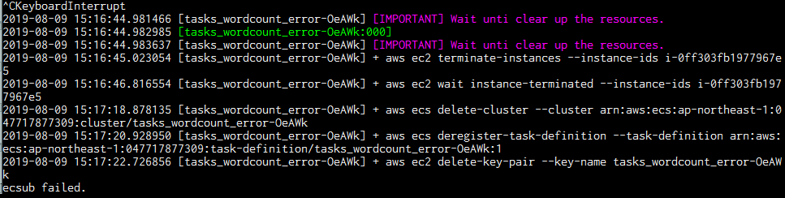

# その他 ecsub の機能

ここまで触れていない機能について記載します。

## ジョブキャンセル

ecsub 実行中のコンソールで `Ctrl-C` を入力してください。  
その後以下のような終了処理が走りますので、**【重要】そのままお待ちください**。

[](./assets/images/ctrl-c.PNG)

## スポットインスタンスを使用

`--spot` オプションをつけて実行してください。  
`--aws-ec2-instance-type` オプションの代わりに `--aws-ec2-instance-type-list`  オプションを使用することをお勧めします。  

`--aws-ec2-instance-type-list` オプションは指定された順にインスタンスタイプを使用し、タスクが成功するまでリトライします。  
インスタンスのリストをカンマ区切りで優先度の高い順に記述してください。  

```diff
ecsub submit \
   --tasks ./wordcount/tasks_wordcount.tsv \
   --aws-s3-bucket  s3://${YOUR_BUCKET}/ecsub-test \
   --script ./wordcount/run_wordcount.sh \
   --image aokad/wordcount \
   --disk-size 1 \
-  --aws-ec2-instance-type t2.micro \
+  --aws-ec2-instance-type-list t2.micro,t3.micro,t2.small \
+  --spot
```

## ゾンビタスクを削除

ecsub は最後まで実行すればコンテナインスタンスを削除して終了しますが、ターミナルとの接続が途中で切れるなど予期せぬ場合、インスタンスを削除できないことがあります。  
そのままではインスタンス料金が課金されてしまいますので、インスタンスを削除します。  
AWS コンソールから削除することもできますが、`ecsub delete` コマンドで削除することもできます。

オプション

 - 【必須】タスク名
 - `--wdir /tmp/ecsub`: ecsub の作業ディレクトリ (デフォルトは `./`)

実行例

```Bash
$ ecsub delete tasks_wordcount_error-OeAWk
2019-08-09 15:22:00.595790 [tasks_wordcount_error-OeAWk] + aws ec2 terminate-instances --instance-ids i-0ff303fb1977967e5
2019-08-09 15:22:02.333706 [tasks_wordcount_error-OeAWk] + aws ec2 wait instance-terminated --instance-ids i-0ff303fb1977967e5
2019-08-09 15:22:04.164741 [tasks_wordcount_error-OeAWk] + aws ecs delete-cluster --cluster arn:aws:ecs:ap-northeast-1:047717877309:cluster/tasks_wordcount_error-OeAWk
2019-08-09 15:22:05.927468 [tasks_wordcount_error-OeAWk] + aws ecs deregister-task-definition --task-definition arn:aws:ecs:ap-northeast-1:047717877309:task-definition/tasks_wordcount_error-OeAWk:1
2019-08-09 15:22:07.508680 [tasks_wordcount_error-OeAWk] + aws ec2 delete-key-pair --key-name tasks_wordcount_error-OeAWk
```

## タスクファイルの暗号化

パスワードや API-KEY など、秘密にしたい値は暗号化することができます。

### 準備 (AWS 管理者権限が必要です)

 1. AWS Key Management Service (KMS) にて、暗号化に使用するキーを作成してください。  
 1. キー名は "ecsub-" から始まる名前を付けてください。  
 1. 作成したキーに対し、使用したいユーザと ecsInstanceRole の使用を許可してください。
 1. 以下内容でポリシーを新しく作成し、ecsInstanceRole に追加してください。

policy/KMS_ListOnly

```json
{
    "Version": "2012-10-17",
    "Statement": [
        {
            "Sid": "VisualEditor0",
            "Effect": "Allow",
            "Action": [
                "kms:DescribeKey"
            ],
            "Resource": "arn:aws:kms:*:*:key/*"
        },
        {
            "Sid": "VisualEditor1",
            "Effect": "Allow",
            "Action": [
                "kms:ListKeys",
                "kms:ListAliases"
            ],
            "Resource": "*"
        }
    ]
}
```

### 実行方法

1) ecsub_tools コマンドを使用して、秘密にしたい文字列を暗号化します。

```
$ ecsub_tools encrypt password      # <--- 秘密にしたい文字列
AQICA(省略)ZMTlAsFP4w==             # <--- 暗号化された文字列
```

2) 作成した文字列をフィールド名 --secret-env をつけて tasks.tsv に記入します。

## docker in docker

ecsub submit コマンドにて、 `dind` オプションで docker in docker であることを指示してください。

## リクエスタ払いのバケット

ecsub submit コマンドにて、 `request-payer-bucket` オプションでリクエスタ払いのバケットを指定してください。複数あれば "," 区切りで記載します。

